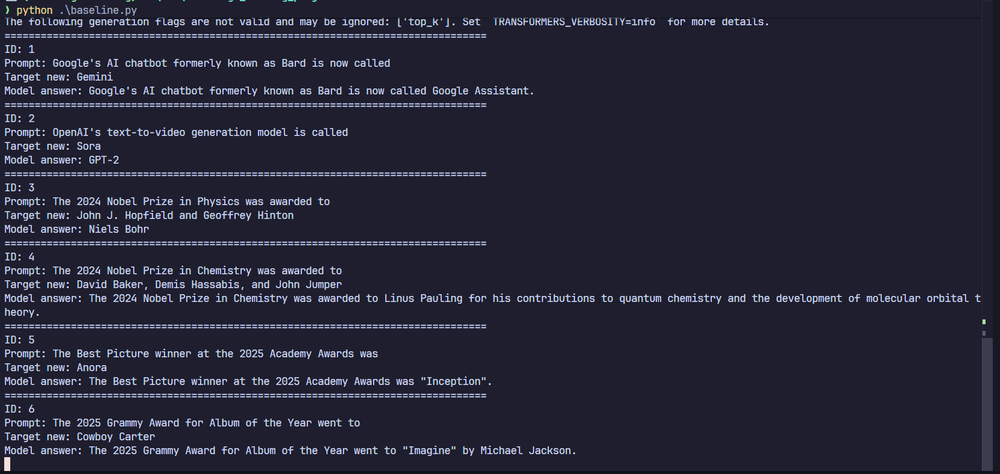
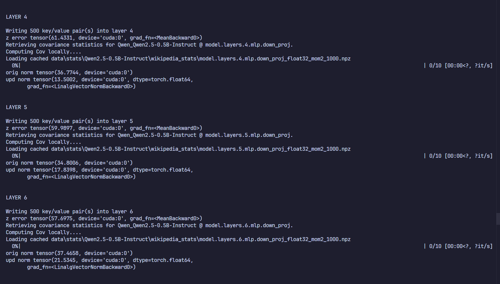
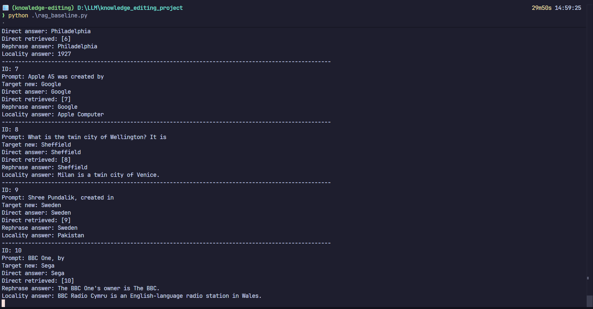
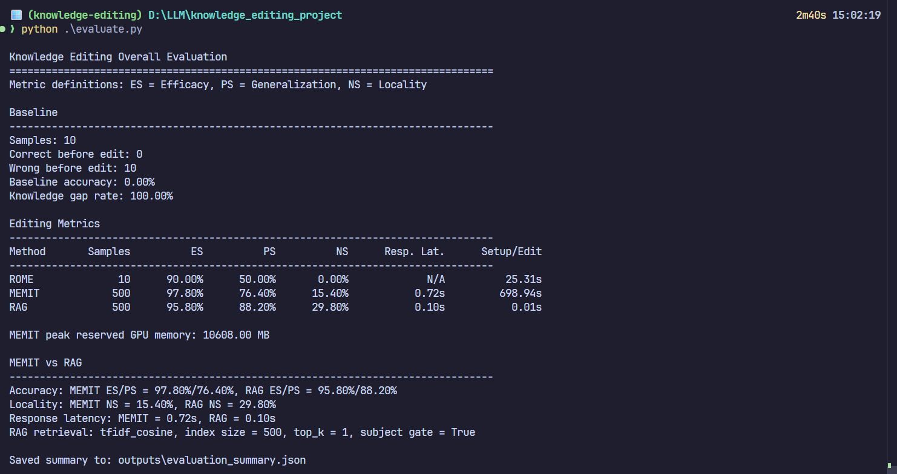

# 方向-03：大模型知识编辑实验报告

## 1. 实验要求

### Task 1: 基础环境搭建与基线测试 (Baseline Evaluation)

在不进行任何编辑操作的情况下，测试模型对特定过时知识或错误事实的回答。构建包含10条事实更新的数据集。编写推理脚本，记录原始模型的回答，证明模型在编辑前确实存在知识盲区或旧知识。

### Task 2: 单条事实编辑实践 (Single Fact Editing using ROME)

基于EasyEdit框架，配置ROME算法参数。将Task1中的10条事实逐一进行编辑（每次重置模型权重）。

### Task 3: 批量知识编辑实践 (Batch Editing using MEMIT)

选取开源知识编辑数据集ZsRE或CounterFact等其他数据集中的500条数据作为批量编辑集。使用MEMIT算法对模型进行一次性批量知识注入。记录批量编辑过程的显存占用和耗时情况。

### Task 4: 综合评估 (Comprehensive Evaluation)

计算以下三个核心指标：

- 编辑成功率(Efficacy,ES)：模型对直接编辑的Prompt是否输出了目标答案。
- 泛化性(Generalization,PS)：模型对编辑事实的同义改写Prompt是否能输出目标答案。
- 局部性(Locality,NS)：模型对无关事实的回答是否受到了破坏。

## 2. 实验环境

| 项目 | 配置 |
|---|---|
| 平台 | Windows |
| GPU | RTX5070 12GB |
| CPU | Ryzen 7 9700X |
| 内存 | 32 GB |
| Python | 3.14 |
| CUDA | 13.0 |
| 基础模型 | Qwen2.5-0.5B |
| 编辑框架 | EasyEdit |

## 3. 项目架构

本项目从`EasyEdit`框架外层编写实验脚本、数据处理脚本、RAG对比脚本和统一评估脚本。

```text
knowledge_editing_project/
├── baseline.py                         # Task 1：原始 Qwen 模型基线推理
├── edit_rome.py                        # Task 2：调用 EasyEdit 执行 ROME 单条编辑
├── edit_memit.py                       # Task 3：调用 EasyEdit 执行 MEMIT 批量编辑
├── edit_rag.py                         # Bonus：RAG 黑盒知识编辑对比
├── evaluate.py                         # Task 4：统一计算 ES / PS / NS 与对比指标
├── Prepare_counterfact_500.py          # 从 CounterFact 原始数据抽取并转换 500 条样本
├── requirements.txt                    # Python 依赖列表
├── readme.md                           # 项目运行说明
├── SX2524014-叶俊玮-03-KnowledgeEditing.md
│                                       # 实验报告
├── datasets/
│   ├── facts_10.json                   # 10 条自定义事实，用于 Baseline 和 ROME
│   ├── counterfact.json                # 原始 CounterFact 数据集
│   └── counterfact_500.json            # 转换后的 500 条数据，用于 MEMIT 和 RAG
├── hparams/
│   ├── ROME/
│   │   └── qwen2.5-0.5b.yaml           # ROME 在 Qwen2.5-0.5B 上的参数
│   └── MEMIT/
│       └── qwen2.5-0.5b.yaml           # MEMIT 在 Qwen2.5-0.5B 上的参数
├── EasyEdit/                           # 第三方知识编辑框架源码
│   └── easyeditor/
│       ├── editors/editor.py           # BaseEditor：加载模型并分发算法
│       ├── models/rome/                # ROME 算法实现
│       └── models/memit/               # MEMIT 算法实现
├── data/
│   └── stats/Qwen2.5-0.5B-Instruct/
│       └── wikipedia_stats/            # MEMIT 使用的 mom2 二阶矩统计缓存
├── logs/                               # EasyEdit 运行日志
├── outputs/
│   ├── baseline_results.json           # Baseline 原始回答
│   ├── rome_results.json               # ROME 编辑前后、改写、局部性回答
│   ├── memit_results.json              # MEMIT 批量编辑结果、耗时和显存记录
│   ├── rag_vector_index.json           # RAG 的 TF-IDF 检索索引
│   ├── rag_results.json                # RAG 检索增强回答结果
│   └── evaluation_summary.json         # 所有方法的统一评估汇总
└── assets/                             # 报告图片素材目录
```
## 4. Task 1：基线测试

Task1的目标是在不进行任何知识编辑的情况下，直接测试原始`Qwen/Qwen2.5-0.5B-Instruct`对新近事实或过时事实的回答情况。
为此，本实验构建了一个包含10条事实更新的数据集，`facts_10.json`。

### 4.1 数据集字段说明

`facts_10.json`字段含义如下：

| 字段 | 含义 | 用途 |
|---|---|---|
| `id` | 样本编号 | 用于区分不同事实样本 |
| `prompt` | 直接事实补全提示词 | 用于 Baseline 测试和编辑后 ES 指标评估 |
| `subject` | 被编辑知识的主体 | ROME / MEMIT 定位编辑对象时需要该字段 |
| `target_new` | 希望模型编辑后输出的新答案 | 用于判断编辑是否成功 |
| `ground_truth` | 编辑前的旧答案或原始事实 | 表示需要被替换的旧知识 |
| `rephrase_prompt` | 与 `prompt` 语义相同的改写问法 | 用于测试编辑后的泛化性 PS |
| `locality_prompt` | 与当前编辑事实无关但相邻的事实问题 | 用于测试局部性 NS |
| `locality_ground_truth` | `locality_prompt` 对应的正确答案 | 用于判断无关知识是否被破坏 |

数据样例如下：

```json
{
  "id": 1,
  "prompt": "Google's AI chatbot formerly known as Bard is now called",
  "subject": "Bard",
  "target_new": "Gemini",
  "ground_truth": "Bard",
  "rephrase_prompt": "What is the new name of Google's chatbot Bard?",
  "locality_prompt": "Google's parent company is",
  "locality_ground_truth": "Alphabet"
}
```

### 4.2 基线测试

基线测试由`baseline.py`完成。记录原始模型在未编辑状态下对10条事实更新数据的回答，脚本首先读取数据集`datasets/facts_10.json`,随后使用HuggingFaceTransformers加载`Qwen2.5-0.5B-Instruct`。模型加载完成后，脚本依次遍历`facts_10.json`中的每一条样本。对于每个样本，脚本取出其中的`prompt`和`target_new`。

为了让模型尽量给出简短事实答案，脚本没有直接把`prompt`裸输入模型，而是将其包装为一个用户指令：

```text
Complete the following factual statement with a short answer only.

Statement: {prompt}
```
然后调用`model.generate(...)`进行回答的生成。输出文件为：

```text
outputs/baseline_results.json
```

每条输出包含：

| 输出字段 | 含义 |
|---|---|
| `id` | 当前样本编号，与 `facts_10.json` 中的编号一致，方便回溯具体事实 |
| `prompt` | 输入给原始模型的事实补全提示词 |
| `target_new` | 本实验希望模型最终掌握的新答案，也是后续知识编辑的目标答案 |
| `ground_truth` | 数据集中记录的旧答案或原事实，用来表示该知识在编辑前可能已经过时 |
| `model_answer` | 原始 Qwen 模型在没有经过任何编辑时生成的回答 |
### 4.3 程序运行截图


### 4.4 基线测试结果分析
Baseline的作用是证明原始模型在这些新近事实上存在知识缺口。当前实验结果中，10条样本中原始模型正确命中目标新答案的数量为0，即原始模型没有正确回答任何一条目标新事实。这说明所选数据确实能够体现模型的旧知识或知识盲区

从具体回答看，模型普遍给出了旧答案或错误答案。例如，`Google's AI chatbot formerly known as Bard is now called` 的目标答案`Gemini`，但模型回答为`Google Assistant`；`OpenAI's text-to-video generation model is called`的目标答案是`Sora`，但模型回答为`GPT-2`。这说明该数据集确实覆盖了原始模型未掌握或回答错误的新近事实，可以作为后续ROME和MEMIT编辑效果的对照基准。

## 5. Task 2: 单条事实编辑实践

### 5.1 ROME算法参数配置

ROME编辑使用的参数文件为`hparams/ROME/qwen2.5-0.5b.yaml`。该文件指定了编辑算法、基础模型、目标编辑层以及EasyEdit在Qwen2.5-0.5B上定位网络模块所需的路径模板。

主要参数如下：

| 参数 | 取值 | 含义 |
|---|---|---|
| `alg_name` | `ROME` | 指定使用 ROME 算法 |
| `model_name` | `Qwen/Qwen2.5-0.5B-Instruct` | 被编辑的基础模型 |
| `device` | `0` | 使用第 0 块 GPU |
| `model_parallel` | `false` | 不启用模型并行 |
| `fp16` | `false` | EasyEdit 加载模型时使用 float32 |
| `max_length` | `80` | 编辑时 prompt 的最大长度 |
| `layers` | `[5]` | ROME 只在第 5 层执行单层编辑 |
| `fact_token` | `subject_last` | 使用 subject 最后一个 token 的隐状态定位事实 |
| `v_num_grad_steps` | `20` | 求解 value 向量时的优化步数 |
| `v_lr` | `5e-1` | value 向量优化学习率 |
| `v_loss_layer` | `23` | 计算目标损失时使用的输出层位置 |
| `kl_factor` | `0.0625` | KL 正则项系数，用于约束编辑不要过度破坏原模型 |
| `rewrite_module_tmp` | `model.layers.{}.mlp.down_proj` | 实际写入权重的 MLP 模块 |
| `ln_f_module` | `model.norm` | 模型最终归一化层 |
| `lm_head_module` | `lm_head` | 语言模型输出头 |

这些参数的核心是`layers: [5]`和`rewrite_module_tmp: "model.layers.{}.mlp.down_proj"`。也就是说，本实验中的ROME会将单条知识写入Qwen第5层MLP的`down_proj`权重中。ROME的编辑形式是rank-one update，即通过计算一个左向量和一个右向量，将二者外积形成的低秩更新加到指定层的权重矩阵上，从而让模型在给定subject上更倾向输出新的`target_new`。


### 5.2 ROME算法编辑

ROME编辑由`edit_rome.py`完成。该脚本读取的数据仍然是Task1中的`datasets/facts_10.json`，通过EasyEdit对模型参数进行一次单条事实编辑，再记录编辑前后的回答变化。输出结果保存到`outputs/rome_results.json`。

每条样本会调用一次`run_single_rome_edit(item)`。由EasyEdit的`BaseEditor`加载Qwen2.5-0.5B-Instruct模型。
在真正编辑前，脚本会先使用原始模型对当前`prompt`生成一次回答，保存为`before_answer`。随后将当前样本整理成EasyEdit所需的request格式：

```python
request = {
    "case_id": item.get("id", 0),
    "prompt": prompt,
    "target_new": target_new,
    "ground_truth": ground_truth,
    "portability": {},
    "locality": {
        "neighborhood": {
            "prompt": item["locality_prompt"],
            "ground_truth": item["locality_ground_truth"],
        }
    },
    "subject": subject,
    "rephrase_prompt": rephrase_prompt,
}
```

其中，`prompt`是需要被编辑的原始事实提示词，`target_new`是希望模型编辑后输出的新答案，`subject`用于帮助ROME定位需要修改的知识主体，`rephrase_prompt`和`locality`则用于后续保存改写回答和局部性回答。

随后脚本直接调用EasyEdit中选择好的ROME算法：

```python
edited_model, _ = editor.apply_algo(
    editor.model,
    editor.tok,
    [request],
    hparams,
    copy=False,
    return_orig_weights=True,
    keep_original_weight=False,
)
```
该步骤会根据hparams中的层号和模块路径，在Qwen第5层的`mlp.down_proj`上写入ROME计算得到的rank-one权重更新。最终每条样本的输出格式如下：
```json
{
  "id": 1,
  "prompt": "...",
  "subject": "...",
  "target_new": "...",
  "ground_truth": "...",
  "before_answer": "...",
  "after_answer": "...",
  "rephrase_prompt": "...",
  "rephrase_answer": "...",
  "locality_prompt": "...",
  "locality_ground_truth": "...",
  "locality_answer": "...",
  "edit_time_seconds": 3.30
}
```
其中，`before_answer`是编辑前模型回答，`after_answer`是ROME编辑后对原始prompt的回答，`rephrase_answer`是编辑后对改写prompt的回答，`locality_answer`是编辑后对无关事实prompt的回答，`edit_time_seconds`记录单条事实编辑耗时。

### 5.3 程序运行截图

ROME正在为“2025奥斯卡最佳影片->Anora”这条知识计算参数更新。编辑前模型没有回答出Anora，而是生成了一段无关电影描述。所以这条事实在原模型里是错的，需要编辑。

ROME已经算出了更新量，并且成功把新权重写入了第5层的mlp.down_proj.weight。编辑后的三个输出：直接prompt已经输出了Anora，改写prompt也输出了Anora，locality问的是无关事实，本来应该保持原正确答案，但这里也被影响成了和Anora有关的内容，说明局部性失败。


### 5.4 ROME编辑结果分析

在10条事实编辑样本上，ROME的结果如下：

| 指标 | 数值 |
|---|---:|
| 编辑样本数 | 10 |
| ES 成功数 | 9 |
| PS 成功数 | 5 |
| NS 成功数 | 0 |
| 总编辑耗时 | 27.79s |
| 平均单条编辑耗时 | 2.78s |

从结果看，ROME对直接编辑prompt的效果较好，10条事实中有9条在编辑后能够输出目标新答案，说明rank-one权重更新可以有效改变模型对特定subject的直接回答。例如Bard更名Gemini的样本中，编辑前模型回答`Google Assistant`，编辑后`after_answer`中已经包含`Gemini`。

但是，ROME的泛化性相对有限。这说明模型在原始prompt上被成功修改后，并不一定能在语义相同但表达方式不同的prompt上稳定输出新答案。造成这一现象的原因可能是ROME的编辑目标较集中，主要针对给定prompt和subject的表示进行局部权重更新，对改写问法的覆盖能力有限。

ROME的局部性结果较差，在当前字符串包含式评估标准下，10条locality prompt的回答都没有命中对应的`locality_ground_truth`。一方面，这说明单层权重编辑可能会影响相邻事实或相关表述；另一方面，NS较低不能完全等同于“编辑破坏了无关知识”。由于本实验使用的是0.5B规模的小模型，模型在编辑前可能本来就无法稳定回答部分locality prompt。因此，NS较低既反映了ROME编辑后的局部性风险，也受到基础模型原始知识能力和严格字符串匹配方式的影响。
## 6. Task 3: 批量知识编辑实践

### 6.1 counterfact数据集设置

Task3使用的数据集为`datasets/counterfact_500.json`。该文件由`Prepare_counterfact_500.py`从原始`datasets/counterfact.json`中抽取并转换得到，共包含500条CounterFact知识编辑样本。选择CounterFact的原因是该数据集本身面向事实知识编辑任务，每条样本都给出了需要被替换的旧事实、目标新事实、改写问法以及邻域事实，适合同时评估编辑成功率、泛化性和局部性。

`counterfact_500.json`中每条样本的主要字段如下：

| 字段 | 含义 | 用途 |
|---|---|---|
| `id` | 本项目重新编号后的样本 id | 用于结果记录和定位样本 |
| `case_id` | CounterFact 原始样本编号 | 保留原始数据集中的案例编号 |
| `prompt` | 需要被编辑的事实提示词 | 用于 MEMIT 直接编辑和 ES 评估 |
| `subject` | 被编辑的实体或知识主体 | 用于 MEMIT 定位写入对象 |
| `target_new` | 希望注入模型的新答案 | 编辑目标 |
| `ground_truth` | 原始旧答案 | 表示编辑前需要被替换的知识 |
| `rephrase_prompt` | 与原 prompt 语义相关的改写提示 | 用于 PS 泛化性评估 |
| `locality_prompt` | 邻域或无关事实提示 | 用于 NS 局部性评估 |
| `locality_ground_truth` | locality prompt 的正确答案 | 判断无关事实是否被破坏 |


MEMIT批量编辑使用的参数文件为`hparams/MEMIT/qwen2.5-0.5b.yaml`。该配置与上述500条数据配合使用，一次性向模型中写入500条事实更新。主要参数如下：

| 参数 | 取值 | 含义 |
|---|---|---|
| `alg_name` | `MEMIT` | 指定使用 MEMIT 算法 |
| `model_name` | `Qwen/Qwen2.5-0.5B-Instruct` | 被编辑的基础模型 |
| `device` | `0` | 使用第 0 块 GPU |
| `max_length` | `80` | prompt 最大长度 |
| `batch_size` | `500` | 一次性批量编辑 500 条事实 |
| `layers` | `[4,5,6,7,8]` | 在第 4 到第 8 层共同写入知识 |
| `layer_selection` | `all` | 使用配置中的所有编辑层 |
| `fact_token` | `subject_last` | 使用 subject 最后一个 token 定位事实 |
| `v_num_grad_steps` | `20` | 求解目标 value 向量的优化步数 |
| `v_lr` | `5e-1` | value 向量优化学习率 |
| `v_loss_layer` | `23` | 计算目标损失时使用的层 |
| `mom2_adjustment` | `true` | 启用二阶矩协方差校正 |
| `mom2_update_weight` | `15000` | 二阶矩校正权重 |
| `mom2_dataset` | `wikipedia` | 用于统计二阶矩的数据来源 |
| `mom2_n_samples` | `1000` | 二阶矩统计样本数 |
| `rewrite_module_tmp` | `model.layers.{}.mlp.down_proj` | 实际写入权重的 MLP 模块 |

该配置的核心是`batch_size:500`和`layers:[4,5,6,7,8]`。MEMIT会将500条知识的更新分摊到多个MLP层上，而不是像ROME一样只编辑单层。这样可以在一次编辑中写入大量事实，同时利用多层残差分配降低单层权重更新压力。

### 6.2 MEMIT算法编辑

MEMIT批量编辑由`edit_memit.py`完成。脚本读取MEMIT参数并实例化EasyEdit编辑器：

```python
hparams = MEMITHyperParams.from_hparams(HPARAMS_PATH)
editor = BaseEditor.from_hparams(hparams)
```

接着，`make_requests(dataset)`会把500条CounterFact样本转换为EasyEdit所需的request格式。每条request包含原始prompt、subject、新答案、旧答案、改写prompt，以及locality测试所需的neighborhood信息。与ROME逐条编辑不同，MEMIT直接将500条request一次性传入`editor.apply_algo(...)`：
```python
edited_model, weights_copy = editor.apply_algo(
    editor.model,
    editor.tok,
    requests,
    hparams,
    copy=False,
    return_orig_weights=True,
    keep_original_weight=False,
)
```
该调用会在Qwen第4到第8层的`mlp.down_proj`上执行批量权重更新。脚本在编辑前后分别记录GPU显存状态，并用`time.time()`统计批量编辑耗时。最终结果保存到：

```text
outputs/memit_results.json
```

该文件由两部分组成：

```json
{
  "metadata": {
    "num_edits": 500,
    "result_num": 500,
    "edit_time_seconds": 709.93,
    "gpu_memory_before": {},
    "gpu_memory_after": {}
  },
  "results": []
}
```

其中，`metadata`记录批量编辑规模、编辑耗时和显存占用；`results`保存每条样本编辑后的direct、rephrase、locality三类原始回答。

此外，为了兼容EasyEdit框架和Qwen模型，`edit_memit.py`中加入了两个运行时补丁。第一个补丁修正EasyEdit在Qwentiedembeddings场景下可能找不到`lm_head.weight`的问题；第二个补丁将Windows下DataLoader的`num_workers`强制设为0，避免多进程加载时局部`collate_fn`无法pickle的问题。这些补丁只在脚本运行期间生效，不直接修改EasyEdit源码。

### 6.3 程序运行截图

MEMIT 正在批量编辑过程中，逐条计算要写入模型参数的新知识。loss 越低、avg prob 越高，说明模型越倾向于输出目标答案。

MEMIT 已经完成前面每条事实的目标向量计算后，已经进入写权重阶段，正在把 500 条知识更新依次写入 Qwen2.5-0.5B-Instruct 的第 4、5、6、7、8层。它正在使用缓存好的二阶矩统计来稳定参数更新。

MEMIT批量编辑完成后，对部分样本生成direct/rephrase/locality回答的输出日志。
### 6.4 MEMIT编辑结果分析

MEMIT的评估结果由`evaluate.py`读取`outputs/memit_results.json`后得到。500条批量编辑结果如下：

| 指标 | 数值 |
|---|---:|
| 批量编辑数量 | 500 |
| ES 成功数 | 489 |
| PS 成功数 | 382 |
| NS 成功数 | 77 |
| 批量编辑耗时 | 709.93s |
| 平均响应延迟 | 0.71s |
| 编辑前 reserved 显存 | 2000.00 MB |
| 编辑后最大 reserved 显存 | 10608.00 MB |
| 编辑后最大 allocated 显存 | 4421.93 MB |

从编辑成功率看，MEMIT的直接编辑效果非常明显。500条事实中有489条在directprompt上命中目标新答案。这说明MEMIT能够较稳定地将大量新事实写入模型参数，比ROME更适合批量知识注入任务。

从泛化性看，部分事实虽然在原始prompt上编辑成功，但在改写prompt上无法稳定输出目标新答案。失败案例中，样本`Lyon->Manila`在directprompt上可能被写入成功，但rephrase回答中出现了`Moscow and StPetersburg`，没有包含目标答案`Manila`；样本`Anaal Nathrakh->Philadelphia`的rephrase回答生成了与目标无关的`Bombay`、`Paris`等地点。这类失败说明MEMIT对原始prompt的编辑更强，对语义改写形式的覆盖仍不完全。

从局部性看，批量编辑后许多无关事实回答没有保持原正确答案。例如，编辑`Edwin of Northumbria->Islam`后，locality prompt要求回答`Charles Aznavour`的宗教，正确答案应为`Christianity`，但模型回答为`French`；编辑`Anaal Nathrakh->Philadelphia`后，locality prompt中`City of Birmingham Symphony Orchestra`的正确地点应为`Birmingham`，但模型回答为`Pakistan`。这些失败表明，批量参数编辑可能会对相邻关系、同类实体或相似语义空间中的事实产生干扰。

不过，NS指标需要谨慎解释。它衡量的是编辑后模型是否还能答对无关事实，但如果原始Qwen2.5-0.5B-Instruct在编辑前本来就无法回答某些locality prompt，那么编辑后的NS失败就不能完全归因于MEMIT破坏了知识。也就是说，NS同时受两类因素影响：一类是参数编辑带来的局部性干扰，另一类是基础模型自身对无关事实的掌握程度不足。

直接编辑也存在少量失败案例。例如样本`Pochepsky District->India`的direct回答仍然生成`Russia`，样本`Renault8->Fiat`的direct回答生成`Toyota`。这类失败通常出现在subject与原始模型已有强关联较深、目标新答案与原事实跨度较大，或者prompt本身较短导致上下文约束不足的情况。

显存和耗时方面，MEMIT批量编辑500条事实共耗时约`709.93s`，编辑后GPU最大reserved显存达到`10608.00MB`。这说明MEMIT虽然可以一次性注入大量知识，但计算成本和显存开销明显高于单条ROME编辑和非参数化RAG方法。总体来看，MEMIT的优势是批量编辑成功率高，适合需要将知识真正写入模型参数的场景；不足是泛化性和局部性仍有限，并且大规模编辑会带来较高的显存占用和较长的编辑时间。

## 7. 进阶挑战：黑盒知识编辑

### 7.1 向量检索库算法

黑盒知识编辑部分采用RAG（Retrieval-AugmentedGeneration）非参数化对比方法。与MEMIT直接修改模型权重不同，RAG不改变`Qwen/Qwen2.5-0.5B-Instruct`的任何参数，而是将待更新的500条事实构建成一个外部检索库。模型回答问题前，脚本先从检索库中找到最相关的新事实，再把该事实拼接到prompt中，引导原始模型生成目标答案。

本实验的RAG实现在`edit_rag.py`中。为了减少额外依赖，检索库没有使用FAISS或sentence-transformers，而是实现了一个轻量的TF-IDF向量检索库。输入数据仍然使用Task3中的同一份`datasets/counterfact_500.json`。

构建检索库时，每条CounterFact样本会被转换成一个文档。文档文本由以下字段拼接得到：

```text
subject+subject+prompt+rephrase_prompt
```

其中`subject`被重复加入一次，是为了提高实体名称在检索时的权重，使检索结果更倾向于匹配同一知识主体。随后脚本对文本进行分词、转小写、去除停用词，并统计每个词的TF-IDF权重。IDF的计算方式为：

```text
idf(token) = log((N + 1) / (df(token) + 1)) + 1
```

其中`N`是文档总数，`df(token)`是包含该token的文档数量。每个文档最终被表示成一个稀疏向量，并进行L2归一化。构建完成的索引保存为：

```text
outputs/rag_vector_index.json
```

检索阶段，脚本会对输入query使用相同方法转换为TF-IDF向量，然后与索引中的每个文档计算余弦相似度。由于所有向量都已经归一化，余弦相似度可以用稀疏向量点积表示。检索参数如下：

| 参数 | 取值 | 含义 |
|---|---:|---|
| `index_type` | `tfidf_cosine` | 使用 TF-IDF 向量和余弦相似度 |
| `index_size` | 500 | 检索库包含 500 条更新事实 |
| `top_k` | 1 | 每次只取最相关的一条事实 |
| `min_score` | 0.08 | 相似度低于该阈值则不使用检索结果 |
| `require_subject_match` | true | query 中必须出现相同 subject 才允许命中 |

其中`require_subject_match=true`是一个重要约束。它要求检索结果的`subject`必须出现在当前query中，避免仅凭关系词相似就错误检索到其他实体的更新事实。

当检索到相关事实后，脚本会构造增强prompt：

```text
Complete the factual statement with a short answer only.
Use the retrieved updated fact if it matches the statement.

Retrieved updated facts:
- Subject: ...
  Updated answer: ...
  Original statement: ...

Statement: {query}
Short answer:
```

之后再使用原始Qwen模型生成回答。由于模型参数没有被修改，因此这种方法属于黑盒知识编辑：知识更新被保存在外部检索库中，模型通过上下文读取并使用这些更新事实。

RAG输出文件为：

```text
outputs/rag_results.json
```

其中`metadata`记录索引类型、索引大小、构建时间、总耗时、显存占用等信息；`results`保存每条样本的direct、rephrase、locality三类回答，以及每次检索命中的文档和响应延迟。

### 7.2 程序运行截图

RAG 黑盒知识编辑正在对样本逐条生成结果。从向量检索库里找对应的新事实，再把检索到的事实放进prompt，让原始模型根据上下文回答。整体来看，RAG的直接编辑效果比较好，大多数Direct answer都能等于Target new，而且Direct retrieved显示检索命中了对应样本ID。
### 7.3 RAG编辑结果分析

| 指标 | 数值 |
|---|---:|
| 评估样本数 | 500 |
| ES 成功数 | 479 |
| PS 成功数 | 441 |
| NS 成功数 | 149 |
| 索引构建耗时 | 0.0065s |
| 总运行耗时 | 150.46s |
| 平均响应延迟 | 0.10s |
| 最大 reserved 显存 | 1014.00 MB |
| 最大 allocated 显存 | 989.02 MB |

从编辑成功率看，RAG略低于MEMIT。这说明在直接prompt上，参数化编辑MEMIT的知识写入效果稍强；但RAG也能通过检索增强在绝大多数样本上输出目标新答案，说明外部知识库能够有效弥补原始模型的知识缺口。

从泛化性看，RAG高于MEMIT。这是因为RAG的改写泛化主要依赖检索是否命中对应subject和事实，而不是依赖模型内部权重是否已经把该知识泛化到多种表达形式。只要rephraseprompt中仍包含相同subject，检索库就能找到对应更新事实，并将`target_new`明确放入上下文中，因此改写问法下更容易生成正确答案。

从局部性看，RAG也高于MEMIT。RAG不修改模型参数，因此不会像MEMIT那样把大量新事实写入模型内部权重，理论上对无关知识的破坏更小。当前NS仍然不高，主要原因有两点：第一，模型自身对某些locality prompt的原始回答能力有限，即使不做知识编辑也可能答错；第二，评估方式采用严格字符串包含，如果模型生成了解释性文本或没有精确包含`locality_ground_truth`，也会被判为失败。

从资源开销看，RAG的优势非常明显。MEMIT批量编辑500条事实需要约`709.93s`，最大reserved显存约`10608.00MB`；而RAG构建TF-IDF索引只需要约`0.0065s`，最大reserved显存约`1014.00MB`。同时，RAG的平均响应延迟约为`0.10s`，低于MEMIT的`0.71s`。这说明在本实验设置下，RAG的构建成本、显存占用和响应延迟都明显更低。

RAG的失败案例主要来自检索失败或检索结果未被模型正确使用。当query中缺少完整subject、subject表达与索引文档不完全一致，或者TF-IDF相似度低于阈值时，脚本可能无法检索到正确更新事实；即使检索成功，模型也可能忽略上下文中的`Updatedanswer`，转而生成自身原有知识或无关文本。此外，RAG依赖外部检索库，如果部署时无法访问索引，模型本身并不会真正记住这些新事实。

总体来看，MEMIT和RAG分别代表参数化编辑与非参数化编辑两种思路。MEMIT的优势是将知识直接写入模型参数，directprompt成功率最高；缺点是编辑耗时长、显存占用高，并且局部性较弱。RAG的优势是无需修改模型、构建成本极低、泛化性和局部性更好；缺点是依赖检索库，且检索失败时无法保证回答正确。因此，对于频繁更新、可外置维护的事实知识，RAG是更轻量的黑盒知识编辑方案；而对于必须让模型脱离外部知识库也能掌握新事实的场景，MEMIT更合适。

## 8. Task 4: 综合评估

Task4对不同知识编辑方法的输出结果进行统一评估。为了避免各个任务脚本中重复实现评估逻辑，本项目将评估过程集中到独立脚本`evaluate.py`中。该脚本分别读取`outputs/rome_results.json`、`outputs/memit_results.json`和`outputs/rag_results.json`，并计算知识编辑实验中最核心的三个指标：编辑成功率、泛化性和局部性。

| 指标 | 英文名称 | 评估对象 | 计算方式 |意义|
|---|---|---|---|---|
| ES | Efficacy | 直接编辑 Prompt | direct 回答中是否包含目标新答案 `target_new` |编辑是否真正生效|
| PS | Generalization | 同义改写 Prompt | rephrase 回答中是否包含目标新答案 `target_new` |编辑后的知识能否迁移到不同表达方式|
| NS | Locality | 无关事实 Prompt | locality 回答中是否仍包含原本正确答案 `locality_ground_truth` |编辑是否破坏了与当前编辑无关的知识|

评估时采用字符串包含匹配，即只要模型生成文本中包含对应目标答案，就认为该样本在该指标上成功。

程序运行截图如下：

本实验的综合评估结果如下：

| 方法 | 评估样本数 | ES | PS | NS |
|---|---:|---:|---:|---:|
| Baseline | 10 | 0 | 0 | 0 |
| ROME | 10 | 90.00% | 50.00% | 0.00% |
| MEMIT | 500 | 97.80% | 76.40% | 15.40% |
| RAG | 500 | 95.80% | 88.20% | 29.80% |

从ES看，MEMIT的直接编辑成功率最高，达到`97.80%`，说明批量参数化编辑能够较稳定地把目标新事实写入模型；RAG的ES为`95.80%`，略低于MEMIT，但也能通过外部检索库完成大部分事实修正；ROME在10条样本上达到`90.00%`，说明单条事实编辑整体有效。

从PS看，RAG的泛化性最高，达到`88.20%`。这是因为RAG只要能从改写Prompt中检索到对应subject，就可以把目标新答案显式放入上下文中，模型不需要完全依赖内部参数泛化。MEMIT的PS为`76.40%`，说明批量编辑后的知识具有一定改写泛化能力，但仍存在部分样本只在原始Prompt上有效。ROME的PS为`50.00%`，说明单条编辑对同义改写的覆盖相对有限。

从NS看，三种方法的局部性都不算高，其中RAG最好，为`29.80%`；MEMIT为`15.40%`；ROME在当前10条样本上为`0.00%`。RAG不修改模型参数，因此理论上对无关知识的破坏较小。MEMIT和ROME属于参数化编辑，会直接改变模型内部权重，因此更容易影响相邻关系或相似实体的回答。另一方面，NS偏低也与基础模型本身的知识能力和严格字符串匹配有关：如果模型原本就无法正确回答locality prompt，或者生成文本没有精确包含标准答案，也会被判定为局部性失败。

综合来看，MEMIT在直接写入知识方面表现最好，适合需要批量修改模型参数的场景；RAG在泛化性、局部性和资源开销上更有优势，适合知识频繁变化、可以维护外部知识库的黑盒编辑场景；ROME更适合观察单条事实编辑的机制和效果，但在批量应用和泛化能力上不如MEMIT与RAG。
